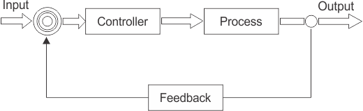
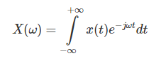
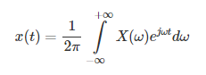
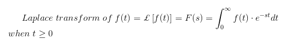
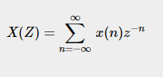

# **Synthesis of continuous-time control systems.**
## **Control System:**
### **Definitions:**
“A control system is a set of mechanical or electronic devices that regulates other devices or systems by way of [control loops](#m370udcee4er).”

“A control system is defined as a system of devices that manages, commands, directs, or regulates the behavior of other devices or systems to achieve a desired result.”

In other words, the definition of a control system can be simplified as “a system that controls other systems.”

As human civilization is being modernized day by day the demand for automation has increased alongside it. Automation requires control over systems of interacting devices.
### **Types of Control Systems:**
Control systems are categorized based on their characteristics and applications:

- **On the basis of feedback:**
  - **Open-loop Control Systems:**

These systems are only dependent on the input and totally independent of the output (feedback) of the system.

For example, Electric Hand Dryers, Bread Toaster,  

- **Closed-loop Control Systems:**

The systems in which output has an effect on input to the system as it’s giving feedback and input is adjusted accordingly.

For example, An air conditioner, Missile launched and controlled by radar.

- **On the basis of the input signal:**
  - **Continuous-time control systems:**

The systems that deal with continuous time signals are called continuous-time control systems. E.g. the flow of water over a dam. (explained later)

- **Discrete-time control systems:**

On the other hand, discrete-time control systems are systems that use discrete time signals. E.g. customers arrive at 3:15, 3:23, 4:01, etc.
## **Continuous-time control system:**
The continuous-time control systems are the type of control systems in which signals and variables are represented as continuous functions of time. Time is treated as a continuous variable, and signals can take on any value within a continuous range.

There are several types of continuous control systems, including:

- Proportional-integral-derivative (PID) controllers:

They are the most common type of continuous control system, and they use a combination of proportional, integral, and derivative control to achieve the desired output.

- State space controllers:

They use mathematical models of the system to determine the necessary inputs.

- Model predictive controllers:

They use predictions of the system's future state to determine the inputs.

Overall, continuous control systems are widely used in a variety of applications, such as motor control, temperature control, and process control.
## **Synthesis of continuous-time control system:**
- The synthesis of continuous-time control systems is the process of designing a controller that can regulate the output of a system. The controller is designed to ensure that the output of the system follows a desired trajectory. 
- The synthesis of continuous-time control systems involves the design of a feedback control system that can regulate the output of a system. The feedback control system is designed to ensure that the output of the system follows a desired trajectory. The synthesis of continuous-time control systems is an important area of research in control theory and has many applications in engineering and science.
# **The gain and phase margin.**
The gain and phase margin are derived from a Bode plot.
## **Bode Plot:**
A Bode plot is a graph of the frequency response of a system. It shows the changes in magnitude and phase as a function of frequency.

The Bode plot for a linear, time-invariant system with a transfer function consists of a magnitude plot and a phase plot. This is done on two semi-log scale plots. The top plot is typically magnitude or “gain” in dB. The bottom plot is "phase", most commonly in degrees.

- Phase: phase refers to the delay between the input and output signals.
- Gain: refers to the difference in magnitude of the input and output signals.

## **Gain Margin:**
- definition? It is the amount of gain that can be increased or decreased without making the system unstable. The greater the gain margin, the greater will be the stability of the system.
- how to calculate? the vertical distance between the magnitude curve and the x-axis at the phase crossover frequency.
- Unit? usually expressed as a magnitude in dB (decibels)
- formula? The Gain Margin (GM) formula can be expressed as `|GM = 0 - G dB|` where G is gain. This is the magnitude (in dB) as read from the vertical axis of the magnitude plot at the phase crossover frequency. For example, If the gain is 20 then the gain margin is -20 decibels.

## **Phase Margin:**
- definition? It is the amount of phase, which can be increased or decreased without making the system unstable. The greater the Phase Margin, the greater will be the stability of the system.
- how to calculate? the vertical distance between the phase curve and the x-axis at the gain crossover frequency.
- Unit? usually expressed as a phase in degrees.
- formula? The formula for Phase Margin (PM) can be expressed as `|PM = 𝜙 - (-180°)|` Where 𝜙 is the phase lag (a number less than 0). This is the phase as read from the vertical axis of the phase plot at the gain crossover frequency. For example, the phase lag is -189°. Hence the phase margin is equal to -189° – (-180°) = -9° (unstable).

# **Linear systems and their description in time- and frequency domains.**
In order to understand the linear control system, we should first understand the principle of superposition. 
## **Principle of Superposition:**
The principle of superposition theorem includes two important properties and they are explained below:
### **Homogeneity:** 
A system is said to be homogeneous, if we multiply input with some constant A then the output will also be multiplied by the same value of constant (i.e. A).
### **Additivity:**
Suppose we have a system S and we are giving the input to this system as a1 for the first time and getting the output as b1 corresponding to input a1. On the second time we are giving input a2 and corresponding to this, we are getting the output as b2. Now suppose this time we are giving input as a summation of the previous inputs (i.e. a1 + a2) and corresponding to this input suppose we are getting the output as (b1 + b2) then we can say that system S is following the property of additivity.
## **Linear System:**
Linear control systems as those types of control systems which follow the principle of homogeneity and additivity.
### **Examples of Linear Control System:**
Consider a purely resistive network with a constant DC source. This circuit follows the principle of homogeneity and additivity. All the undesired effects are neglected and assuming the ideal behavior of each element in the network, we say that we will get linear voltage and current characteristics. This is an example of a linear control system.
## **Description of Linear Systems in Time- and Frequency Domains:**
Linear systems can be described and analyzed in both the time domain and the frequency domain. Here's a description of linear systems in each domain:
### **Time Domain:**
In the time domain, a linear system is characterized by its behavior and response over time. The system's input and output signals are represented as functions of time. The response of a linear system in the time domain is typically described by differential equations or difference equations, depending on whether the system is continuous-time or discrete-time, respectively. In the time domain, the behavior of a linear system is governed by the principles of linearity, superposition, and time invariance.
### **Frequency Domain**:
In the frequency domain, a linear system is characterized by its behavior and response as a function of frequency. The input and output signals are analyzed in terms of their frequency content and how the system modifies the amplitudes and phases of different frequency components.

The frequency domain representation provides insights into system frequency response, gain, phase shift, resonance, and stability. It enables the design and analysis of frequency-based control techniques such as Bode plots, Nyquist plots, and frequency response analysis. These techniques allow engineers to assess the system's stability, identify resonant frequencies, design filters, and determine the system's performance at different frequencies.
### **Transformation of a Linear System from Time Domain to Frequency Domain:**
Two common mathematical tools used for these transformations are the Fourier Transform and its variants.

**Fourier Transform (FT):**

The Fourier Transform is a mathematical technique that transforms a function of time, x(t), to a function of frequency, X(ω).

**Inverse Fourier Transform (FT):**

The inverse Fourier transform is a mathematical formula that converts a signal in the frequency domain ω to one in the time (or spatial) domain t.

**Fourier Transform Properties:**

The following are the important properties of the Fourier transform

**Duality** – If h(t) has a Fourier transform H(f), then the Fourier transform of H(t) is H(-f).

**Linear transform** – Fourier transform is a linear transform. Let h(t) and g(t) be two Fourier transforms, which are denoted by H(f) and G(f), respectively. In this case, we can easily calculate the Fourier transform of the linear combination of g and h.

**Modulation property** – According to the modulation property, a function is modulated by the other function, if it is multiplied in time.

Moreover, there are variations and extensions of these transforms, such as the [Laplace Transform](#1f6v7t3g83m0) for continuous-time systems and the [Z-Transform](#h0fi2mnx2kwq) for discrete-time systems.

# **Appendix:**
**Control Loop:**

A control loop is a system comprising all the hardware components (sensors, switches, & motors) and control functions needed for the measurement and adjustment of a variable that controls a control system process. [3]

A control loop is the fundamental building block of control systems.

There are two main types of control loops: open loops that take human input and closed fully autonomous loops.

Sensor - Thermostat

Controller - Checking if target is achieved

Final Control Element - Heater

The Final Process (Heating the water)

A temperature control loop is one of the most common examples of a control loop. The process to be controlled is established, in our case it's the temperature of water. A sensor measures the process value (PV) i.e. the current value of the water temperature. The sensor feeds the calculated value to the controller, which initiates a control process required to achieve a target. The final control element receives the manipulated values from the controller and physically reduces or increases the temperature. [2]

**Laplace Transform:**

**Z-Transform:**

# **Bibliography:**
1. <https://www.electrical4u.com/control-system-closed-loop-open-loop-control-system/>
1. <https://www.watlow.com/blog/posts/setting-up-a-control-loop>
1. <https://www.techtarget.com/whatis/definition/control-loop>
1. <https://www.electrical4u.com/bode-plot-gain-margin-phase-margin/>
1. <https://www.electrical4u.com/types-of-systems-linear-and-non-linear-system/>
1. <https://www.electrical4u.com/laplace-transformation/>
1. <https://www.tutorialspoint.com/what-is-z-transform>
