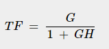

# **Principles of Control.**
## **Control System:**
### **Definitions:**
“A control system is defined as a system of devices that manages, commands, directs, or regulates the behavior of other devices or systems to achieve a desired result.”

“A control system is a set of mechanical or electronic devices that regulates other devices or systems by way of [control loops](https://docs.google.com/document/d/1fYtWlUnOfJyUkD5DCjek2nZsQ8BDapo7GNTxu_K4CUE/edit#bookmark=id.m370udcee4er).”

As human civilization is being modernized day by day the demand for automation has increased alongside it. Automation requires control over systems of interacting devices.
## **Control Loop:**
### **Definitions:**
“A control loop is a system comprising all the hardware components (sensors, switches, & motors) and control functions needed for the measurement and adjustment of a variable that controls a control system process.”

“A control loop is the fundamental building block of control systems.”

A temperature control loop is one of the most common examples of a control loop. The process to be controlled is established, in our case it's the temperature of water. A sensor measures the process value (PV) i.e. the current value of the water temperature. The sensor feeds the calculated value to the controller, which initiates a control process required to achieve a target. The final control element receives the manipulated values from the controller and physically reduces or increases the temperature.
### **Components of Control Loop:**
A control loop is made of three main components, a sensor, a controller, and a final control element. 

The **sensor** takes a reading of the process variable or a related measurement.

The **controller** receives the signal from the sensor and then forwards it to instrumentation to final control elements.

The **final control element** adjusts the process variables to achieve the desired set point.

Sensor - Thermostat

Controller - Checking if target is achieved

Final Control Element - Heater

The Final Process (Heating the water)

# **Feedback Control.**
In feedback control, the variable being controlled is measured and compared with a target value. 

This difference between the actual and desired value is called the error. Feedback control manipulates the input to the system to minimize this error.
## **Types of Feedback Control:**
There are two types of feedback control: negative and positive.

**Negative Feedback:**

By definition, negative feedback is when a change (increase/decrease) in some variable results in an opposite change (decrease/increase) in a second variable. Negative feedback is the most useful control type since it typically helps a system converge toward an equilibrium state. It is used in mostly amplifier circuits and many other control systems like motor control systems, etc.

**Positive Feedback:**

As opposed to negative feedback, positive feedback is when a change (increase/decrease) in some variable results in a subsequently similar change (increase/decrease) in a second variable. Positive feedback can lead a system away from an equilibrium state thus rendering it unstable, even potentially producing unexpected results. It is extensively used in the oscillator circuits.
## **Components of Feedback Control:**
A feedback control system consists of five basic components: (1) input, (2) process being controlled, (3) output, (4) sensing elements, and (5) controller and actuating devices.
# **Open Loop Control.**
An open-loop system is a type of control system in which the output of the system depends on the input but the input or the controller is independent of the output of the system. These systems do not contain any feedback loop and thus are also known as non-feedback systems.

In an open loop system, the output can be adjusted/varied by varying the input but the output has no effect on the input. The output of the open loop system can be determined only by its present state input. If the output is affected due to some external noise/disturbance, the open loop system cannot correct it.

Also, there is no chance to correct the transition errors in open loop systems so there is more chance to occur errors.

## **Open Loop System Applications:**
We use open-loop control systems in many applications of our day-to-day lives. Some of the popular systems, which are designed based on the concept of open-loop control systems, are mentioned below:

- Washing Machine
- Electric Bulb
- Electric Hand Drier
- Time-based Bread Toaster
- Automatic Water Faucet
- TV Remote Control
## **Advantages of Open Loop Control System:**
- Open Loop Control Systems are very simple and easy to design.
- These are considerably cheaper than other types of control systems.
- Maintenance of an open-loop control system is very simple.
- Generally, open loop systems are stable up to some extent.
- These types of systems are easy to construct and convenient to use.
## **Disadvantages of Open Loop Control System:**
- The bandwidth of the open loop control system is less.
- The non-feedback system doesn’t facilitate the process of automation.
- Open loop systems are inaccurate in nature and also unreliable.
- If their output is affected by some external disturbances, there is no way to correct them automatically as these are non-feedback systems.
# **Set Point Control.**
In control theory, a setpoint is the desired or target value for an essential variable, or process value (PV) of a control system, which may differ from the actual measured value of the variable. It is the target value that an automatic control system.

For example, a boiler control system might have a temperature setpoint, that is a temperature the control system aims to attain.
# **Reference Signal.**
A reference signal in a control system is the excitation signal given to the system. It specifies the desired behavior or performance of a system. It is usually given as an input to a controller, which then generates an appropriate control signal for the system to follow the reference signal as closely as possible. The reference signal can be a constant value, a periodic waveform, a random signal, or any other function of time.

For example, consider a robotic arm that needs to move to a specific position and orientation. The reference signal in this case is a vector that specifies the desired coordinates and angles of the end-effector of the arm. The controller measures the current position and orientation of the end-effector and compares it with the reference signal. If there is an error between them, the controller calculates the torques that need to be applied to each joint of the arm to minimize the error and move the end-effector toward the reference signal.

A reference signal can also be used for testing or evaluating a system's performance. For instance, a sinusoidal reference signal can be used to measure the frequency response of a system, which indicates how well the system can track different frequencies of input signals.
# **The Role of Negative Feedback.**
## **Negative Feedback:**
Feedback is the process by which a fraction of the output signal, either a voltage or a current, is used as an input. If this feedback fraction is opposite in value or phase (“anti-phase”) to the input signal, then the feedback is said to be **Negative Feedback** or **degenerative feedback**.

Negative feedback opposes or subtracts from the input signals giving it many advantages in the design and stabilization of control systems. For example, if the system's output changes for any reason, then negative feedback affects the input in such a way as to counteract the change.

In the case of negative feedback, the difference between the input signal and the feedback signal drives the system. This difference is known as an **error signal**. Due to several technical benefits, negative feedback is the most widely used type of feedback in control systems.
## **Transfer Function of Negative Feedback:**
The transfer function of a control system having negative feedback is given by the following expression,

As in the negative feedback, the error signal is a difference between two signals. Therefore, the gain of the control system with negative feedback is low. Negative feedback is mostly used in the amplifiers.
# **Requirements of Control System:**
Bandwidth – Bandwidth is the range of frequencies of a system. Bandwidth is decided by the operating frequencies. A system having a high bandwidth is considered a good control system.

Accuracy – The tolerance of errors in an instrument is known as accuracy. We can improve the accuracy by using feedback elements like adding an error detector circuit in the control system to increase the accuracy.

Sensitivity – The rate of change of a control system with the change in its surroundings is called sensitivity. A good control system should be sensitive to its input only and should not be sensitive to the surrounding parameters.

Stability – If the input of a system is zero then the output should also be a zero value. If the input changes, the output also changes as per the system function, this is a stable system.

Oscillation – Oscillation means the fluctuations of the output of a system. These oscillations affect the stability and a higher number of these fluctuations in a system will decrease the stability of a system.

Noise – Undesired signal input due to external sources is known as noise. A good control system should have a high noise tolerance value, so it can reduce the noise level. System performance decreases as noise value increases.

Speed – In control systems, the time taken by the output to be stable is known as speed. High-speed systems are considered good control systems.** 

**Bibliography:**

1. <https://www.techtarget.com/whatis/definition/control-loop>
1. <https://eng.libretexts.org/Bookshelves/Industrial_and_Systems_Engineering/Chemical_Process_Dynamics_and_Controls_(Woolf)/11%3A_Control_Architectures/11.01%3A_Feedback_control-_What_is_it%3F_When_useful%3F_When_not%3F_Common_usage>.
1. [www.tutorialspoint.com/difference-between-positive-and-negative-feedback-in-a-control-system](http://www.tutorialspoint.com/difference-between-positive-and-negative-feedback-in-a-control-system)
1. <https://blog.oureducation.in/wp-content/uploads/2013/10/Requirements-for-a-Good-Control-Systems.pdf>
