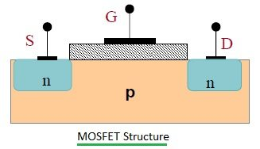
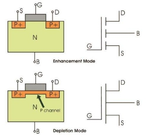
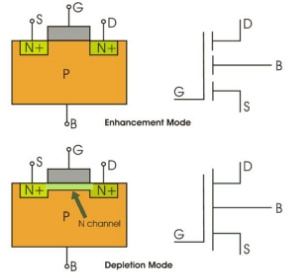
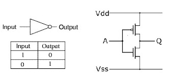
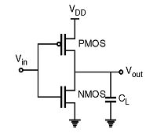

# **MOS transistor: large signal model and characteristics.**
## **MOS transistor:**
The metal oxide semiconductor (MOS) transistor is the building block of most modern digital memories, processors, and logic chips. It is also a common element in many analog and mixed-signal integrated circuits.

A metal–oxide–semiconductor field-effect transistor is a field-effect transistor (FET with an insulated gate) where the voltage determines the conductivity of the device. It is used for switching or amplifying signals. The ability to change conductivity with the amount of applied voltage can be used for amplifying or switching electronic signals.
### **Structure:**

It is a four-terminal device with **Source** (S), **Drain** (D), **Gate** (G), and **body** (B) terminals. The body (B) is frequently connected to the source terminal, reducing the terminals to three. It works by varying the width of a channel along which charge carriers flow (electrons or holes).

The charge carriers enter the channel at the source and exit via the drain. The width of the channel is controlled by the voltage on an electrode called Gate which is located between the source and the drain. It is insulated from the channel near an extremely thin layer of metal oxide. 
### **Different Types of MOSFET**
MOSFET works in two modes-

1. Depletion Mode: The transistor requires the Gate-Source voltage (VGS) to switch the device “OFF”. The depletion-mode MOSFET is equivalent to a “Normally Closed” switch.
1. Enhancement Mode: The transistor requires a Gate-Source voltage(VGS) to switch the device “ON”. The enhancement-mode MOSFET is equivalent to a “Normally Open” switch.
### **Classification of MOS transistor based on the working principle:**
Now with respect to the working principle, MOSFET is classified as follows:

- P-Channel Depletion MOSFET
- P-Channel Enhancement MOSFET
- N-Channel Depletion MOSFET
- N-Channel Enhancement MOSFET 

**P-Channel MOSFET**

The drain and source are heavily doped p+ region and the substrate is in n-type. The current flows due to the flow of positively charged holes, and that’s why known as p-channel MOSFET. 

When we apply negative gate voltage, the electrons present beneath the oxide layer experience repulsive force and are pushed downward into the substrate, the depletion region is populated by the bound positive charges which are associated with the donor atoms. 

The negative gate voltage also attracts holes from the P+ source and drain region into the channel region.

**N-Channel MOSFET**

The drain and source are heavily doped N+ region and the substrate is p-type. The current flows due to the flow of negatively charged electrons and that’s why known as n-channel MOSFET. 

When we apply the positive gate voltage, the holes present beneath the oxide layer experience repulsive force, and the holes are pushed downwards into the bound negative charges which are associated with the acceptor atoms. 

The positive gate voltage also attracts electrons from the N+ source and drains the region into the channel thus an electron reach channel is formed.

###

## **Large-Signal Model:**
A large-signal model is a representation used in the analysis of electric circuits using voltages and currents that are considered above the low-signal category. The main reason for having a low- and large-signal model is that the behavior circuits, specifically the semiconductors, depend on the relative amplitudes of the signals involved. The large-signal model also reveals the characteristics of circuits when the signal levels are near the maximum allowable levels for devices.

Transistor models make use of the large-signal model to predict performance and characteristics during times when maximum signal levels are fed and maximum output is being drawn. The mechanisms for reducing distortion and noise output at the highest signal levels are designed based on large-signal nonlinear models.

In simple terms, the large signal model focuses on how a device or circuit responds to signals that are large enough to cause significant changes in its behavior. This is in contrast to the small signal model, which is used to analyze the device's behavior under small signal conditions.

The large signal model takes into account the ****nonlinear characteristics*** of the device or circuit, such as saturation effects, nonlinearity in voltage-current relationships, and voltage-dependent behavior. The mechanisms for reducing distortion and noise output at the highest signal levels are designed based on large-signal nonlinear models.

# **The MOS transistor as a switch.**
The N-channel enhancement-mode MOSFET is a special component that acts like a switch. When you give it a positive voltage, it allows electricity to flow through it, and when you remove the voltage or make it lower, it blocks the flow of electricity. This makes it useful for controlling devices like lights.

To turn the MOSFET on and make the light turn on, you need to apply a positive voltage to its gate that is higher than a certain threshold voltage. When this happens, the MOSFET allows electricity to flow through it, and the light turns on.

Conversely, if you remove the positive voltage or make it lower than the threshold voltage, the MOSFET blocks the flow of electricity, and the light turns off.

By controlling the voltage applied to the MOSFET's gate, you can control whether the light is on or off.

### **Example of MOSFET as a Switch:**
Consider a situation where you want to digitally control a 12W LED (12V @ 1A) using a Microcontroller. When you press a button connected to the microcontroller, the LED should turn ON. When you press the same button once again, the LED should turn OFF. It is obvious that you cannot directly control the LED with the help of the microcontroller. You need a device that bridges the gap between the microcontroller and the LED. This device should take in a control signal from the microcontroller (usually the voltage of this signal is in the working voltage range of the microcontroller, 5V for example) and supply power to the LED, which in this case is from a 12V supply. The device which I am going to use is a MOSFET. The setup of the above-mentioned scenario is shown in the following circuit.

When a Logic 1 (assuming a 5V Microcontroller, Logic 1 is 5V and Logic 0 is 0V) is supplied to the gate of the MOSFET, it turns ON and allows drain current to flow. As a result, the LED is turned ON. Similarly, when a Logic 0 is given to the gate of the MOSFET, it turns OFF and in turn switches OFF the LED. Thus, you can digitally control a high-power device with the combination of a Microcontroller and MOSFET.
# **CMOS inverter, basic logic gates.**
## **CMOS Inverter:**
It is a device that is used to generate logic functions and is the essential component in all integrated circuits. A CMOS inverter is a FET (field effect transistor), composed of a metal gate that lies on top of oxygen’s insulating layer on top of a semiconductor. These inverters are used in most electronic devices which are accountable for generating data n small circuits.
### **CMOS Inverter Schematic Diagram:**

The logic element like an inverter reverses the applied input signal. In digital logic circuits, binary arithmetic & switching or logic function’s mathematical manipulation are best performed through the symbols 0 & 1. The CMOS inverter truth table is shown above. If the input logic is zero (0) then the output will be high (1) whereas, if the input logic is one (1), then the output will be low (0).

The CMOS inverter circuit diagram is shown below. The general CMOS inverter structure is the combination of both the PMOS & NMOS transistors where the pMOS is arranged at the top & nMOS is arranged at the bottom. The connection of both the PMOS & NMOS transistors in the CMOS inverter can be done like this. The NMOS transistor is connected at the drain (D) & gate (G) terminals, a voltage supply (VDD) is connected at the source terminal of PMOS & a GND terminal is connected at the source terminal of NMOS. Input voltage (Vin) is connected to both the gate terminals of transistors & output voltage (Vout) is connected to the drain (D) terminals of the transistor. It is very significant to observe that the CMOS device does not have any resistors, so it will be more power-efficient. Once the input voltage of CMOS changes between 0 to 5 volts, then both the transistors' states will be changed accordingly. If we design every transistor like a simple switch that is operated through input voltage (Vin), then the operations of the inverter can be observed very simply.
## **CMOS NAND gate.**

P-channel transistors Q1 and Q2 are connected in parallel between +V and the output terminal. N-channel transistors Q3 and Q4 are connected in series between the output terminal and ground.

With Q3 and Q4 transistors ”on” and Q1 and Q2 transistors “off,” the output is a logic 0. This condition happens when both inputs, A and B, are logic 1, and the output is 0. With logic 0 in inputs A and B, Q3 and Q4 transistors are “off,” and Q1 and Q2 transistors are “on,” producing a logic 1 output. When one of the inputs is a logic “1” and the other one is a logic “0”, either Q3 is “off” and Q2 is “on” or Q4 is “off” and Q1 is “on.”
## **CMOS NOR gate.**

P-channel transistors Q1 and Q2 are connected in series between +V and the output terminal. N-channel transistors Q3 and Q4 are connected in parallel between the output and ground.

When both inputs, A and B, are logic 0, Q1 and Q2 are “on,” Q3 and Q4 are “off,” and the output is logic 1. With both inputs logic 1, Q3, and Q4 are “on,” and Q1 and Q2 are “off,” producing a logic 0 output. For the two remaining input combinations, either Q1 is “off” and Q3 is “on” or Q2 is “off” and is Q4 “on”.
## **Other Logics Obtained using CMOS.**

**CMOS AND gate:**

**CMOS OR gate:**

# **The operational amplifier. Negative feedback. Basic applications.**
## **Operational Amplifiers:**
Operational Amplifiers, or Op-amps as they are more commonly called, are one of the basic building blocks of Analogue Electronic Circuits. It is fundamentally a voltage amplifying device designed to be used with external feedback components such as resistors and capacitors between its output and input terminals. These feedback components determine the resulting function or “operation” of the amplifier and by virtue of the different feedback configurations whether resistive, capacitive or both, the amplifier can perform a variety of different operations, giving rise to its name of “Operational Amplifier”.

An Operational Amplifier is basically a three-terminal device which consists of two high impedance inputs. One of the inputs is called the Inverting Input, marked with a negative or “minus” sign, ( – ). The other input is called the Non-inverting Input, marked with a positive or “plus” sign ( + ).

A third terminal represents the operational amplifier's output port which can both sink and source either a voltage or a current. In a linear operational amplifier, the output signal is the amplification factor, known as the amplifier's gain ( A ) multiplied by the value of the input signal and depending on the nature of these input and output signals, there can be four different classifications of operational amplifier gain.
## **Negative Feedback:**
Negative Feedback in Op-Amp

Negative feedback takes a part of the output and subtracts it from the input in such a way that the output is in equilibrium with the input. This means that any change in the input is followed by a similar change in the output. The simplest example of negative feedback is the op-amp follower. In this case, the inverting input is connected to the output and the non-inverting input serves as the signal input.

Following the rules of op-amp behavior where the op-amp will try to maintain a 0V difference in voltage across the inverting and non-inverting inputs, we can understand that the output follows the input to maintain this 0V difference, hence the name follower. If the input to this circuit was 1V, then the output would also be 1V, since the output is directly connected to the inverting input, hence making the voltage difference between the inverting and non-inverting pins 0V. It is realized that the gain of the circuit described is exactly 1 since the ratio of the input voltage and the output voltage is 1.
## **Applications of Op Amps:**
Op amps are used in a wide variety of applications in electronics. Some of the more common applications are: as a voltage follower, selective inversion circuit, a current-to-voltage converter, active rectifier, integrator, a whole wide variety of filters, and voltage comparator.

**Appendix:**

**Bipolar Junction Transistor:**

A Bipolar Junction Transistor, or BJT, is a type of transistor in which the current flow between the collector and the emitter is controlled by the amount of current that flows through the base. It is a type of transistor that uses both electron and hole charge carriers.

**Why MOSFET over BJT?**

MOSFETs are particularly useful in amplifiers due to their input impedance being nearly infinite which allows the amplifier to capture almost all the incoming signal. The main advantage is that it requires almost no input current to control the load current and that’s why we choose MOSFET over BJT.

**Bibliography:**

1. <https://www.electronicsforu.com/technology-trends/learn-electronics/mosfet-basics-working-applications>
1. <https://www.electronicshub.org/mosfet-as-a-switch/>
1. <https://eepower.com/technical-articles/basic-cmos-logic-gates/>
1. <https://www.electronics-tutorials.ws/opamp/opamp_1.html>
1. <https://circuitdigest.com/electronic-circuits/positive-and-negative-feedback-in-op-amp-circuits>
1. <https://www.electronicsforu.com/videos-slideshows/slideshows-presentations/introduction-bipolar-junction-transistor-bjt>
